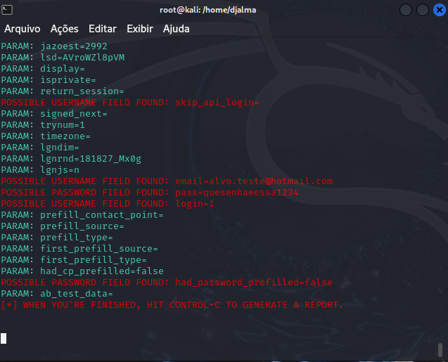

# Cibersegurança-Desafio-Phishing
Desafio do Bootcamp de Cibersegurança para criar Phishing usando o Kali Linux

## Ferramentas usadas
* Kali Linux
* setoolkit

## Passos a seguir
* Entre no Kali Linux
* Abra o Terminal
* Acesso root: `sudo su` + User Password
* Abra o setoolkit: `setoolkit`
* Escolha o tipo de ataque: `Social-Engineering Attacks`
* Escolha o vetor de ataque: `Web Site Attack Vectors`
* Escolha o método de ataque: `Credential Harvester Attack Method`
* Escolha o método de ataque: `Site Cloner`
* Deixe o IP padrão e tecle `Enter`
* Ao pedir a URL do site digite `https://facebook.com`
* Abra o navegador e digite o IP para acessar o "*site*"
* Ao digitar os dados e enviá-los, a página irá se redirecionar para a página verdadeira e os dados enviados para o **setoolkit**

